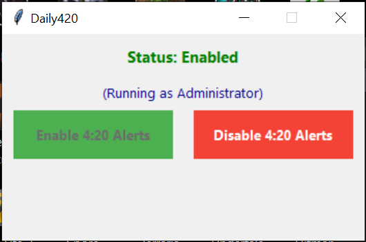

<p align="center">
  
</p>

A Python-powered tool which automatically plays a sound every day at 4:20 AM and 4:20 PM using the Windows Task Scheduler.

---

## Features

*   **Simple GUI:** Easy-to-use graphical interface.
*   **Customizable Sound:** Choose your own alert sound (default: "smoke weed every day").
*   **Automatic Task Management:** Creates and deletes the necessary Windows scheduled tasks directly from the GUI.
*   **User-Friendly:** No command-line or Python knowledge needed if using the provided `.EXE`.
*   **Standalone `.EXE`:** Includes all dependencies

---

<p align="center">
  
</p>
<p align="center">
  <em>The main application window.</em>
</p>

---

##  Requirements

*   **Operating System:** Windows (due to Task Scheduler usage).
*   **Administrator Privileges:** Needed to run the application (for Task Scheduler access).

*If running from Python source code:*
*   Python 3.0+
*   Pygame library (`pip install pygame`)

*(Note: The standalone `.exe` version includes Python and Pygame - no separate installation needed!)*

---

## Usage

There are two ways to use Daily 420 Alerts:

**Option 1: Using the Standalone `.EXE` (Recommended for most users)**

1.  Download the latest `.exe` file from the Releases section.
2.  Save the `.exe` folder somewhere on your computer. (if you want to move the icon, create  ashortcut)
3.  **Important:** Right-click the `.exe` file and select **"Run as administrator"**. This is required to schedule tasks in Windows Task Manager.
4.  Use the GUI to enable or disable (delete) the 4:20 alerts.

**Option 2: Running from Python Source Code**

1.  Ensure you have Python 3.0+ installed.
2.  Clone or download this repository:
3.  Open Command Prompt or PowerShell **as Administrator**.
4.  Navigate to the directory where you cloned/extracted the files.
    ```bash
    cd path\to\Daily 420 Alerts
    ```
5.  Install the required Pygame library:
    ```bash
    py -m pip install pygame
    ```
6.  Run the script:
    ```bash
    py 420.py
    ```
7.  Use the GUI to manage the alerts.

---
